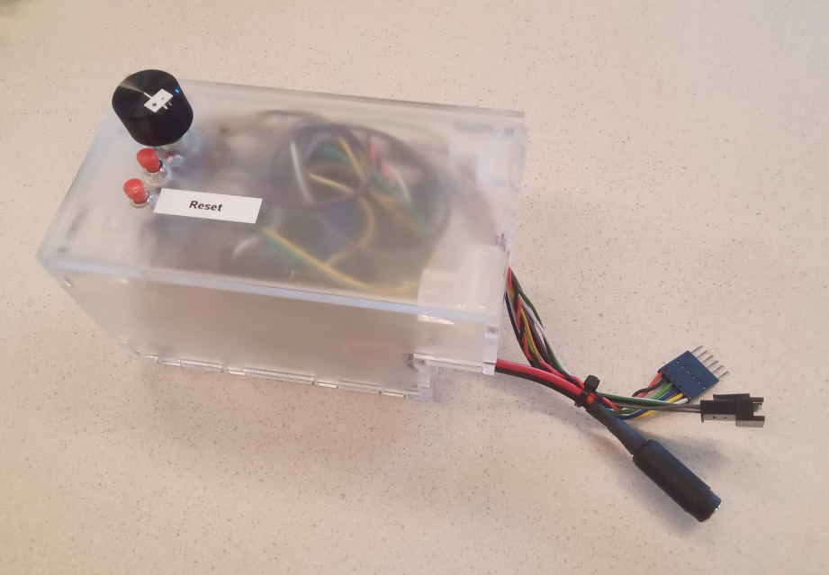

# Stiffness Tester

This repo contains a K64F MCU program for Venkat's Stiffness Tester.

Use uScope to view the live data: https://bitbucket.org/ctw-bw/uscope  
Note: you will need the **HID** version (instead of the serial version).

This program will send a slow sine position reference to the motor to deflect the spring, while measuring the torque.  
The sine has a set amplitude. There is also a torque limit. When this limit is exceeded, the reference position is capped, stopping the joint from being deflected further.

## Usage

Connect the second micro-USB port (marked `K64 USB`) to your computer and use uScope to read the live data.  
The graphs are:

 1. Position reference (degrees)
 2. Encoder readout (degrees)
 3. Motor PWM signal (ratio)
 4. Torque sensor output (Nm)

Optionally, connect the first USB port too (marked `SDA USB`) and use a serial terminal to connect to the board. This works side-by-side with uScope.  
In the terminal, enter a letter followed by a value to change the torque limit and the max. angle. E.g., enter `a20.0` followed by `[Enter]`.

## Hardware

 * MBED K64F microcontroller
 * [ME TS70 5Nm](https://www.me-systeme.de/shop/en/sensors/torque-sensors/ts/ts703) torque sensor
 * [HX711](https://www.otronic.nl/a-64988178/sensors/hx711-weegcel-versterker-module/) loadcell amplifier
 * [Pololu D37](https://www.pololu.com/product/4756) DC motor
 * [DFRobot 2x2A DC](https://www.dfrobot.com/product-69.html) motor shield
 * 9V DC adapter

On the HX711 development kit, the RATE pin of the HX711 chip itself was loosened from ground and connected to VDD, to increase the output rate from 10 Hz to 80 Hz.

## Calibration

By hanging a known weight at a measured distance from the sensor we calibrated the sensor together with the HX711 amplifier.  
This turns out to be `251733.6 bit/Nm`. The sensor has a 24 bit ADC and a default gain of 128. It is run at 5V. Therefor the sensitivity of the torque load cell is `853 Nm/V`. (Such that `torque = input / 2^23 * 5V / 128 * 853 Nm/V`).

## Connections

The motor shield should be stacked on top of the K64F. The BioRobotics shield should be stacked on top op the motor shield.

The jumpers on the motor shield should be set to `PWRIN`, such that the external power supply is used.

The female 2.1 mm DC jack should be connect to the `PWRIN +/-` terminals on the motor shield.

The `M1 +/-` and `M2 +/-` of the motor shield should be connected to the `M1` and `M2` terminal on the BioRobotics shield. (The order of + and - for the motors will flip the direction but otherwise matters not.)

The 6-wire motor connectors need to be connect to the 'M2' connector (white to white and red to red).  
The other end should be connected to the motor (also white to white and red to red). The motor cable extension can also be used here.

On small HX711 breakout board, connect:

 * `GND` to MCU ground
 * `VCC` to MCU +5V
 * `DT` to `D2` on the MCU
 * `SCK` to `D3` on the MCU
 * `E+` to the sensor Vcc (red wire)
 * `E-` to the sensor ground (black wire)
 * `A+` to the sensor output 1 (white wire)
 * `A-` to the sensor output 2 (green wire)
 * `SD/YLW` to the sensor shield

On the K64F, connect:

 * `D2` and `D3` to the amplifier (see above)
 * `D12` to encoder 2, channel B
 * `D13` to encoder 2, channel A
 * `A0` to POT2 (if using the potmeter)
 * `RST` to the first button (pull-up mode)
 * `D8` to the second button (in pull-up mode) (unused)
 * `GND` to the potmeter and both buttons

Baked into the motor shield are the connections:

 * `D4` direction motor 2
 * `D5` PWM motor 2
 * `D6` PWM motor 1
 * `D7` direction motor 1

## Compilation

The program can be compiled locally with MBED Studio, or using the online compiler at [mbed.org](https://mbed.org).

MBED includes submodules through the .lib files. They are not literal Git submodules.
